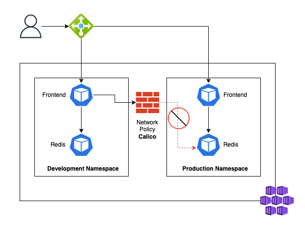
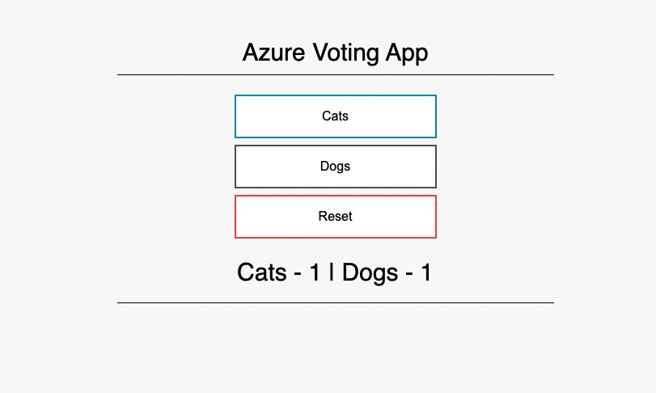

## About this project

This project shows how to use **Calico** as a **Network Policy** plugin in **Azure Kubernetes Service** to prevent a production backend from being accessed by resources from other environments. Calico is supported when using both **Azure CNI** or **kubenet**.

From https://docs.microsoft.com/en-us/azure/aks/use-network-policies:

_When you run modern, microservices-based applications in Kubernetes, you often want to control which components can communicate with each other. The principle of least privilege should be applied to how traffic can flow between pods in an Azure Kubernetes Service (AKS) cluster. Let's say you likely want to block traffic directly to back-end applications. The Network Policy feature in Kubernetes lets you define rules for ingress and egress traffic between pods in a cluster._


## Architecture



### Usage

Create the infrastructure

```
$ az login
$ cd terraform
$ terraform plan -var 'network-policy-demo-rg=<resource_group_name>'
$ terrafom apply -var 'network-policy-demo-rg=<resource_group_name>'
$ az aks get-credentials --name network-policy-demo --resource-group <resource_group_name>
```

Deploy the Vote App to both **development** and **production** namespaces

```
$ kubectl apply -f vote-app-development.yaml
$ kubectl apply -f vote-app-production.yaml
```

Both namespaces now have a Frontend App and Redis as their backend. Let's access the applications using their EXTERNAL-IP.

```
$ kubectl get svc --all-namespaces -l app=azure-vote-front
```

You should see something like this:


_Vote ahead!_

Since Kubernetes by default allows traffic from every pod to every pod, we now have a security flaw, since the Frontend from the development namespace can access the production Redis just fine, let's test it.

```
$ kubectl exec -n development -ti deployment/azure-vote-front -- /bin/bash
$ python3  -c "import redis ; r = redis.Redis(host='azure-vote-back.production.svc.cluster.local', port=6379, socket_timeout=5) ; dogs = r.get('Dogs').decode('utf-8') ; print(dogs)"
```

Let's fix that by appying a Network Policy that only allows the production Front End to access our production Redis.

```
$ kubectl apply -f network-policy-production.yaml
$ kubectl -n production describe networkpolicy backend-policy 

(...)
  PodSelector:     app=azure-vote-back
  Allowing ingress traffic:
    To Port: 6379/TCP
    From:
      NamespaceSelector: name=production
      PodSelector: app=azure-vote-front
(...)
```

Let's test it again, the connection should now be denied.

```
$ kubectl exec -n development -ti deployment/azure-vote-front -- /bin/bash
$ python3  -c "import redis ; r = redis.Redis(host='azure-vote-back.production.svc.cluster.local', port=6379, socket_timeout=5) ; dogs = r.get('Dogs').decode('utf-8') ; print(dogs)"
```

While we're at it, let's go ahead and also deny traffic from the production environment to our development Redis.

```
$ kubectl apply -f network-policy-development.yaml
$ kubectl -n development describe networkpolicy backend-policy 
```

See if it works.

```
$ kubectl exec -n production -ti deployment/azure-vote-front -- /bin/bash
$ python3  -c "import redis ; r = redis.Redis(host='azure-vote-back.development.svc.cluster.local', port=6379, socket_timeout=5) ; dogs = r.get('Dogs').decode('utf-8') ; print(dogs)"
```